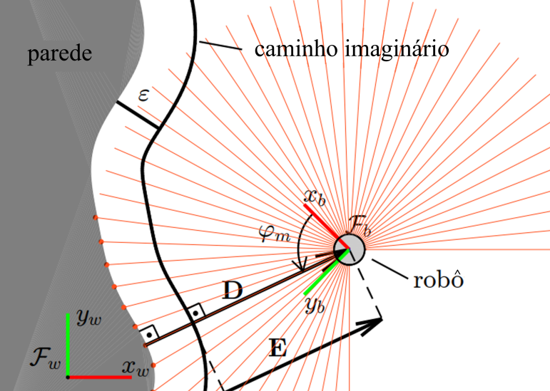
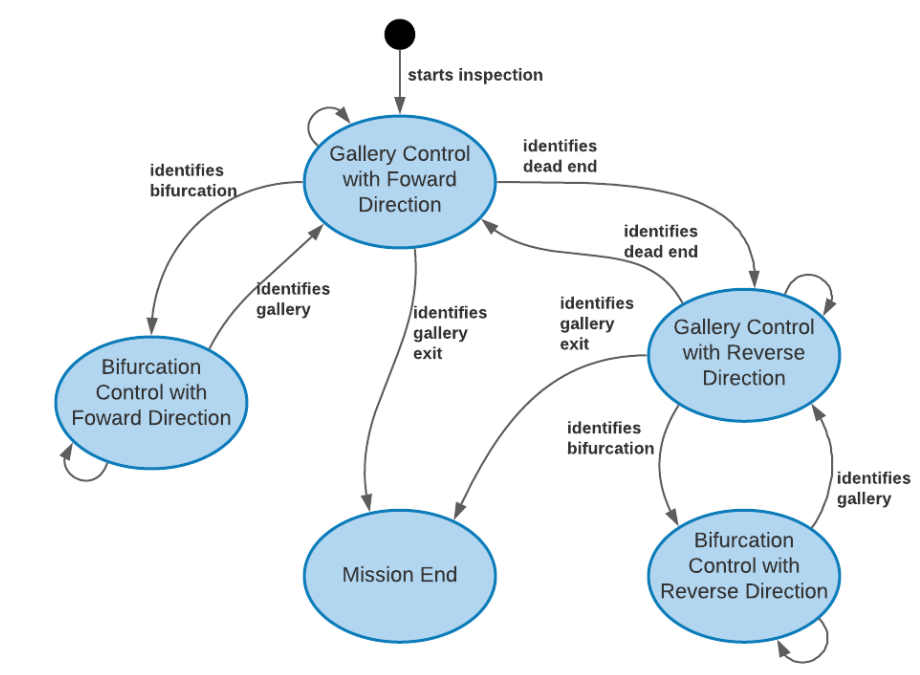
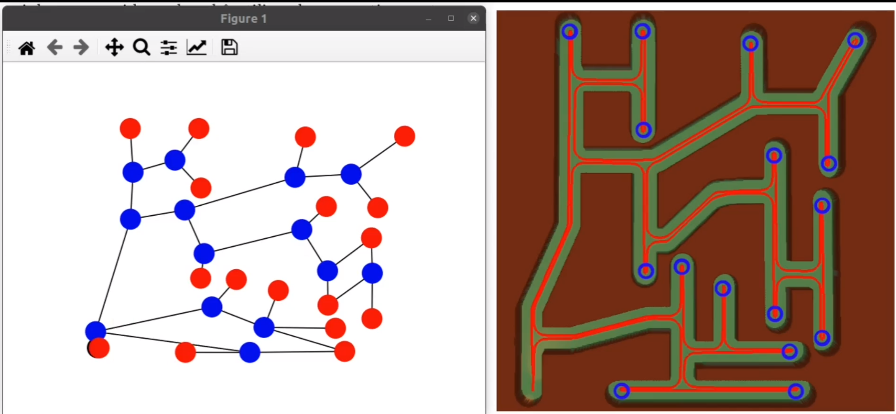

# Gallery Explorer
This is a ROS package for autonomous navigation and topological mapping for a robot inspecting confined environments.

This package is divided into three main nodes, as described in the following sections.

## gallery_explorer.py
This is the node responsible for the robot control. 
It is a vector field based navigation system whose main purpose is to make the robot follow a tangent path alongside a wall.
This control law only needs a planar laser sensor.
<div style="text-align:center"></div>

The considered cinematic model of the robot is the unicycle, i.e.:

$$\begin{equation}
\begin{aligned}
&\dot{x}=v \cos (\theta), \\
&\dot{y}=v \sin (\theta), \\
&\dot{\theta}=\omega
\end{aligned}
\end{equation}$$

The control law is given by:

$$\begin{equation}
\left[\begin{array}{l}
v \\
\omega
\end{array}\right]=\left[\begin{array}{ll}
\cos \left(\varphi_{m}\right) & -\sin \left(\varphi_{m}\right) \\
\frac{\sin \left(\varphi_{m}\right)}{d} & \frac{\cos \left(\varphi_{m}\right)}{d}
\end{array}\right]\left[\begin{array}{l}
\bar{G} \\
H
\end{array}\right]
\end{equation}$$

### Published topics

- ```/cmd_vel```: where the linear and agular speeds are published

### Subscribed Topics

- ```/scan```: planar laser data
- ```/state```: state where the robot is (described in the next section). Used to define the robot direction (forward or reverse).

## state_machine.py
This module is responsible for the identification of which area the robot currently is. 
It also informs to the control module how the robot should navigate (going forward or in reverve).
It has the following states:

1) Gallery control with forward direction
2) Bifurcation control with foward direction
3) Gallery control with reverse direction
4) Bifurcation control with reverse direction
5) Mission End (when the gallery’s exit has been identified)

<div style="text-align:center"></div>

### Published topics

- ```/state```: state where the robot is

### Subscribed Topics

- ```/scan```: planar laser data

## topological_mapping.py
This is a ROS node for creating a topological map of the environment. 
It creates a graph, in which its nodes are some key locations of the environment.
They can be:

- Bifurcations (blue nodes)
- Deadends (red nodes)

An example of the plotted map:

<div style="text-align:center"></div>


### Published Topics

None

### Subscribed Topics

- ```/tf```: robot position
- ```/state```: state where the robot is (described in the next section). Used to define the robot direction (forward or reverse).

## How to Interact

Open the following scene in CoppeliaSim:

- maze_map_smooth_corners_velodyne.ttt

This scene uses a model of the EspeloRobô, hence, it is needed to follow this [tutorial](https://github.com/ITVRoC/espeleo_vrep_simulation)
before in order to set up the simulation parameters.

Enter the following command in the terminal:

```roslaunch duct_explorer galley.launch```


